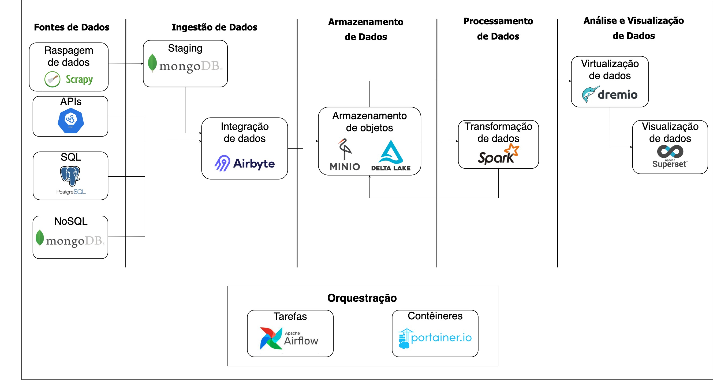

# osdear - Open Source Data Engineering Architecture
An open source cloud-free architecture for data engineering learning purposes focusing in low-cost infrastructure such as personal machines and microcomputers (e.g., Raspberry pi).

The project's main goal is to provide an end-to-end data architecture where one can deal with data ingestion, storage/modeling, transformation and visualization within the platform, without having to worry to maintain all the components and its dependencies individually.

There are two other repositories that complements this implementation:

- [osdear-dags](https://github.com/GabrielMMelo/osdearc-dags): It's a modularized repo for writing Airflow dags
- [osdear-rpi](https://github.com/GabrielMMelo/osdearc-rpi): Repo that contains the **master machine** (see `Infrastructure need`) architecture part.

## Architecture

The whole architecture is shown as above and each component is open sourced and containerized (see images/ folder).

### Orchestration
Almost every action (ingestion, transformation, visualization, switching resources on and off) is managed by Airflow DAGs. It's lightweight, written in Python and easy to go approach to orchestrate the whole architecture.

Portainer.io have been used to orchestrate and expose the Docker Daemons and its containers.

### Data sources
As it uses Airbyte as a Data ingest component, it works with basically any kind of batch input data that are stored in the most common databases or could be crawled through python or other language that could be executed by a Docker container.

### Data Storage
The project relies on MinIO (an open source S3-compatible object storage) and Delta Lake to provide a modern Data Lakehouse solution. 

### Data Transform/Processing
The Apache Spark still stands as an industry standard for data processing, so our platform also tries to that advantage of that. This is the heaviest architecture component and one may face some instability. However, in my tests with a fair amount of data (some megabytes of data), it works like a charm.

### Data virtualization (beta)
In order to make the data lakehouse easy queryable, we provide a automatically Dremio integration that provides an ODBC port to access the data.

### Data Visualization
Finally, for data visualization, there is an Apache Superset minimal server that automatically connects to our data lakehouse and make it easy to generate reports and charts over the data.

## Infrastructure needed

There are 2 infrastructure components needed:

1. Working machine. That could be a personal machine with 8+ GB free.
2. Master machine. That could be a Raspberry Pi (I have been using Raspberry PI 3 B)! It will be responsible for instantiating the resources on the working machine and need to be always up.

## How to
**TODO**

## TODOs:
- [ ] Improve heavily this documentation, adding a "How to" section, enriching all other sections.
- [ ] Improvements in security, such as SSL enforcement, network authentication protocols (e.g., Kerberos)
- [ ] Implement Data discover and catalog with some open source tool (e.g., Amundsen)
- [ ] Implement Data testing to Apache Spark runs (e.g., Great Expectations)
- [ ] Add platform tests